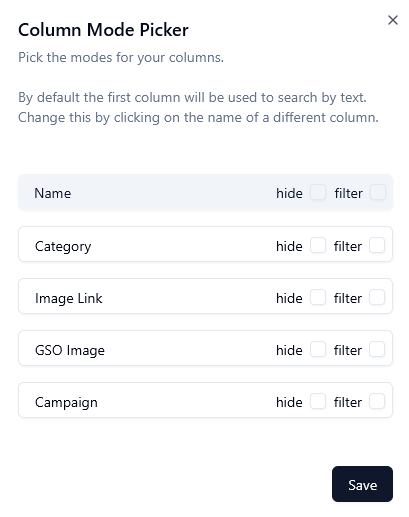

# Game Master Image Display <!-- omit in toc -->

This tool is designed primarily for Game Masters (GMs) running tabletop role-playing games

It allows images to be displayed which set the scene visually for players with a simple two-window setup:

- main page: control panel where the GM can view a collection of images, each with helpful metadata
- view image page: page opened on a separate window (typically on a TV) that shows the currently selected image to the players

Essentially the GM uses one screen to choose what image to display on the other that the players can see (usually the TV)

- [Usage](#usage)
  - [Import usage](#import-usage)
- [Setup](#setup)
- [TODOs](#todos)

## Usage

To get started using this:

- navigate to the [website](https://getusernamefromdatabase.github.io/game-master-image-display/) hosted by github
  - alternatively you can set this up on your local machine, see [Setup](#setup)
- import data, see [Import usage](#import-usage) for more info
  - this can be done by pressing the `Import` button on the top right of the screen
  - select a file or paste a link
  - click `Import` button on the bottom
  - after successful import a screen pops up
- modify how columns are displayed or just click save
  - See [Import usage](#import-usage) for more info
- click the `Image View Window` button on the top right screen
  - this is the place where the selected image is shown
  - feel free to drag/move the newly opened tab to a new window
- click on an image in the original window and see it change in the new one

### Import usage

Images can be imported from links that serve csv files but the must be publically available

In personal use case there is a google docs file which is [published to the web](https://support.google.com/docs/answer/183965) as a csv file  
That link is used to import required data anywhere without having to mess with files

A file can also be used by clicking on the file input
> When file is selected the link input will be ignored,
> the button on the right (⌫) will reset the selected file

---

After successful import a dialog pops up
where you can modify how data is displayed in the image table,
the ways to do that are:

- clicking on a row
  - this will set the clicked column to be used for text search
- dragging a row
  - changes the order in which columns are displayed
- `hide` activating this checkbox
  - will hide the column from being shown in the image table
  - hidden columns can be changed in the `Columns` dropdown menu above the image table
- `filter` activating this checkbox
  - will make it possible to filter data from the column



## Setup

Install Node.js:

- this can be done on their [website](https://nodejs.org/en/download)
- node version manager

> I personally like to use a node version manager, makes it easier to switch between different version should there be need

---

Install the required packages with

```bash
npm install
```

---

Feel free to run the project with

```bash
npm run dev
```

## TODOs

List of things I want to do with this project:

- finish all the TODOs scattered around in code
- segment [image-table.tsx](src/components/image-table.tsx) as it has gone out of hand
- move functions not used for rendering outside of those files
  - the only file on santa's naughty list is [import-dialogue.tsx](src/components/import-dialogue.tsx)
- maybe force the filter option on and have it be in the column header (same place where sorting happens)
